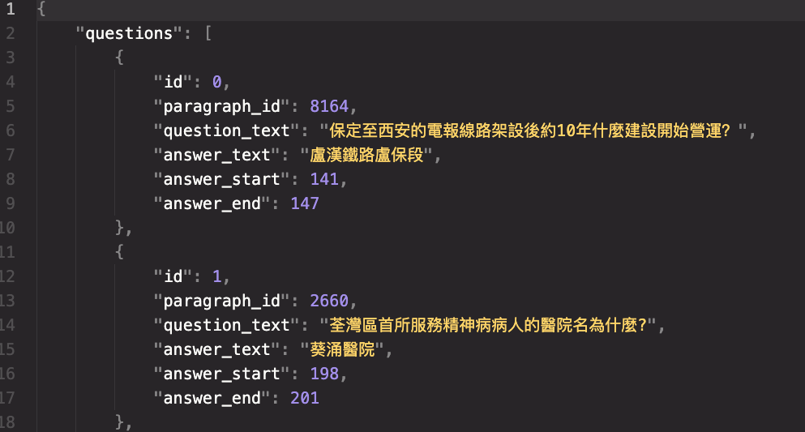
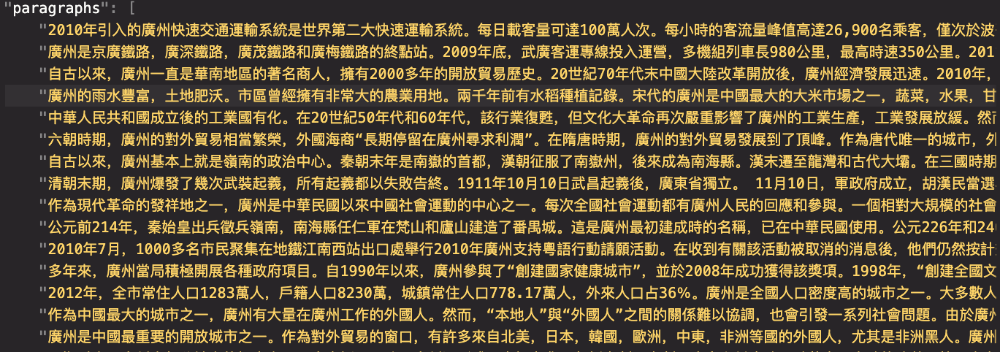
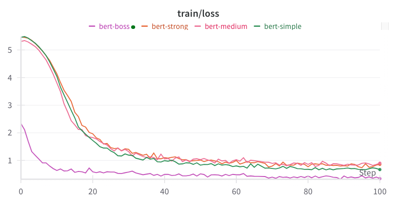
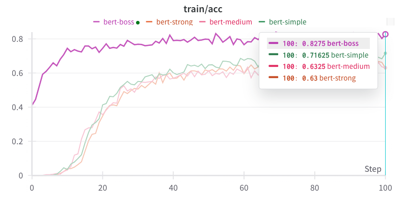
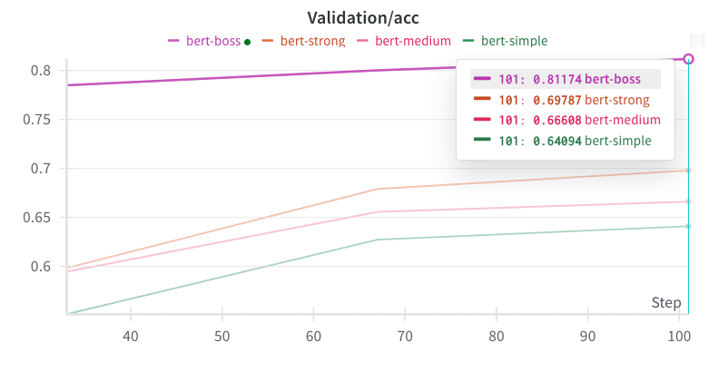

# README.md

##  Question Answering (QA) Task Overview

This project tackles the **extractive question answering (QA)** task, where the goal is to predict the start and end positions of an answer span within a given context paragraph based on a question. The model learns to understand both the context and question and extract the exact sub-span as the answer.

##  Dataset: Chinese QA

This is a Chinese QA dataset where each sample contains:
- A context paragraph in Chinese
- A question (in Chinese)
- An answer (a sub-span of the context)

- id: The unique index of QA sample
- paragraph_id: The id of paragraph used to locate the paragraph from which the question is raised.
- question_text: A part of the model input, usually concatenated before or after the context, forming the structure "[CLS]" "question" "[SEP]" "context" "[SEP]".
- answer_text: The correct answer of the question. 
- answer_start: The starting character index (starting from 0) of the answer in the context paragraph.
- answer_end:  The ending character index of the answer in the context paragraph.

    

    

##  Pretrained Language Model: BERT

We use the [BERT](https://arxiv.org/abs/1810.04805) (Bidirectional Encoder Representations from Transformers) pretrained model as our backbone. BERT is a transformer-based model trained with masked language modeling and next sentence prediction tasks. It has proven very effective for downstream NLP tasks, especially extractive QA.

We use BERT models pretrained on Chinese corpora for this task.

## Kaggle Machine Learning Competition

This project is based on a **[Kaggle Machine Learning Competition](https://www.kaggle.com/competitions/ml2023spring-hw7/overview)**: 

The model was built in four stages:

###  Simple Baseline
- Directly fine-tuned BERT on the dataset.
- Used the standard training and evaluation pipeline.
- Did not handle edge cases in predictions.

###  Medium Baseline
- Fixed a key issue where the model sometimes predicted a **start index greater than the end index**, which leads to invalid or empty answers.
- Introduced post-processing to ensure only valid spans where `start <= end` are selected.
- This significantly improved prediction consistency and answer validity.

### Strong Baseline
- Noticed that the model tended to always find answers near the **middle of the context**, due to training with centered answer spans.
- To improve robustness, we added **random offsets** around the true answer span during training to reduce this positional bias.

### Boss Baseline
- Switched to a **larger BERT variant** for stronger representation power.
- Added **gradient accumulation** to support large-batch training without increasing GPU memory.
- Integrated **learning rate scheduler** to gradually reduce the learning rate during training for smoother convergence.

##  Training Metrics

- **Loss**: Cross-entropy loss over start and end positions.
- **Accuracy (Exact Match)**: The percentage of predictions where the predicted answer exactly matches the ground truth.

## Model Comparison

| Model             | Accuracy (EM) | Parameters |
|------------------|---------------|------------|
| Simple BERT       | 64.094%        | 110M      |
| Medium BERT       | 66.608%        | 110M      |
| Strong BERT       | 69.787%        | 110M      |
| Boss BERT (large) | 81.174%        | 340M      |

    

    

    

---

